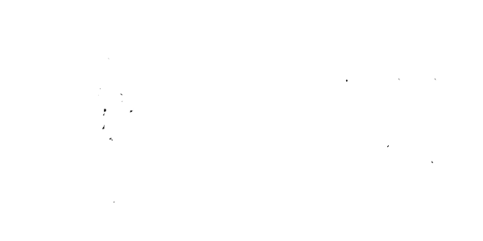

*"Where we're going, we won't need vectors!"*
 
I've been reading about *1-bit quantization* for NNs. The idea is pretty fun! The other day, I ran into some [great research][research] taking things a step further, using NNs to learn logic circuits. I replicated this research from scratch, and trained a neural network **with logic gates in the place of activation functions** to learn the 3x3 kernel function for *Conway's Game of Life*. 

I wanted to see if I could speed up inference by extracting and compiling the learned logic circuit. So I wrote some code to extract and compile the trained network to pure C (including some simple optimizations like copy propogation and dead code elimination)! I benchmarked the original NN using for training (running on the GPU) against the extracted 300-line single-threaded C program (running on the CPU). ...

... and compiling the neural network to C resulted in a **1,744x speedup.** Yeah, crazy right? 

I had a lot of fun. Reproduction steps and development journal below! Enjoy.

# resources

- [original paper/blog][research]
- [training nn in jax](https://docs.jax.dev/en/latest/notebooks/neural_network_with_tfds_data.html)
- [google colab](https://colab.research.google.com/github/google-research/self-organising-systems/blob/master/notebooks/diffLogic_CA.ipynb)
- [conway gol shader](https://blog.tonari.no/shadergarden)
- [flax linen nn docs](https://flax.readthedocs.io/en/v0.5.3/overview.html)
- [optax optimizer docs](https://optax.readthedocs.io/en/latest/index.html)

[research]: https://google-research.github.io/self-organising-systems/difflogic-ca

# dependencies

- jax
- flax
- optax
- einops

# to reproduce

> [!TIP]
> With Nix installed on Linux or macOS, run `nix build github:slightknack/difflogic`

- Clone this repo.
- Create and source a `venv`.
- Install dependencies listed above using `pip`
- Run `python3 main.py`.
  - This will train for 3000 epochs with jit (< 2 minutes).
  - Record the `s/epoch` time. Each epoch is 512 samples:
    - On my machine, I get `0.000139 s/epoch`.
      - (I modified `main.py` to not time weight update, otherwise `0.025 s/epoch` is normal)
  - Verify `test_loss_hard: 0` at the end.
  - After training, this will produce a file, `gate.c`.
- Compile `gate.c` using your preferred c compiler:
  - `gcc gate.c -O3 -o gate -Wall -Wextra`
  - Run with `./gate`
- For benchmarking, comment out visualization
  - In `gate.c` run `C-f` to find `comment out`, three lines
- Benchmark with `time ./gate`
  - This runs 100k steps of GOL on a random board
  - Record how long it takes -> `bench_time`:
    - On my machine, program finishes in `4.08s`.
- Compute the speedup:
  - `(512 * s/epoch) / (bench_time / 100000)`
  - As a lower bound, I got a **1,744x speedup.**
    - (When I benched, I modified `main.py` to not record weight update time.)

Hardware: 2023 MacBook Pro M3, 18GB

# journal

## 2025-05-27

- well, I'm back again. Not planning to spend too much more time on this.
- I implemented better renaming of variables for codegen.
- I have a few fun ideas:
  - Try soft weights. I'll duplicate `main.py` to another file file, `soft.py`.
  - *Reintegration Tracking* is a technique for fluid simulation using CA. I've implemented it before. I might try to get it working, because then I could try to learn a logic circuit for fluid simulation, which would be crazy.
  - I've implemented single-threaded bit-parallel conway's game of life in C, but this is so *embarrassingly* parallel that a GPU compute shader implementation using e.g. WebGPU or [slang][slang] might be in order.
- I really want to write a blog post. So I'll start on that before I do anything else.
  - I'll write it for Anthony, will be fun.
  - Still working on it ... sigh
  - Okay I finished and it's tomorrow that took way too long. Published. Night.


[slang]: https://shader-slang.org/

## 2025-05-26

- back!
- where I left off:
  - got a big network converging
  - didn't get perfect convergence
    - probably due to wiring
- what to try:
  - better wiring
  - soft dot weights
  - extracting discrete network at the end
- planning better wiring
  - essentially, we need to generate unique *pairs* of wires, and shuffle those.
    - If input `m` = `2*n` output, we can do:
      - (1, 2), (3, 4), ...
    - If input `m` = `n` output, we can do:
      - (1, 2), (3, 4), ...
      - (2, 3), (4, 5), ...
    - This is what they do in the paper
      - I think the extend it a little further
      - but anything in m : \[n, 2*n\] is possible
  - I will implement this approach:
    - First pair up: (1, 2), (3, 4), ...
    - Once that is exhausted, pair up: (2, 3), (4, 5), ...
    - Once that is exhausted, do random pairs
  - This is simple but should be better than what I have now.
    - Wait, I can just use itertools.combinations!
      - Nevermind, I want a uniform distribution of unique pairs
- implementing better wiring
  - 25 ms/epoch
  - no tree: epoch 3000, loss 0.0245, hard 0.123
  - with tree: epoch 3000, loss 0.00342, hard 0.00781
  - comb with tree: epoch 3000, loss 0.0145, hard 0.0215
  - comb no tree: epoch 3000, loss 0.0337, hard 0.0801
- okay, so the fancier wiring did not yield better results
  - maybe I should use the unique wiring used in the paper, exactly as described
    - YESYEYSYEYSYEYS!
    - epoch 3000, loss 9.91e-05, hard 0
      - HARD 0
        - we learned a **perfect** circuit for conway's!
- mission complete.
  - Now all the fun stuff:
    - extracting the network
    - writing a little interactive demo and animations
    - writing a blog post
- let me commit here
- wait, I jumped the gun. I still want to do soft dot:
  - the layer generation code is good, I just need to i.e. multiply by 10
  - I also need to do the soft dot
  - and make the wires trainable
- I'm going to duplicate `main.py` to create a alternate version with soft dot: `soft.py`:
- before I actually implement that, I'm going to implement code for extracting the learned hard network:
  - I wrote code to generate some c code, but I really should prune the network before outputting it
  - I wrote code to prune, nice
- let me try a training run, output hard to `gate.c`
  - Output! code has lots of copies, I should probably also implement copy prop sigh
- going to take a break, commit here.
  - ANDs: 69
  - ORs: 68
  - XORs: 17
  - NOTs: 16
- back from break, compiling to c:
  - implemented copy prop
  - implemented dead code elim
  - implemented variable renaming
  - implemented formatting with template
- compiles and it works!
  - `python3 main.py`
  - `gcc gate.c -O3 -o gate`
  - `./gate`
- This is so frickin' cool. I just trained a neural network and compiled the weights to C, at 1 bit quantization.
  - also, note that `cell` is a `uint64_t`, so `conway` in `gate.c` actually performs parallel evaluation of 64 cells at once (e.g. an 8x8 tile)!
- I'm going to try to benchmark this:
  - Well, I implemented a little visualizer TUI thing, which is cool!
  - On a 512x512 grid, battery saver on, it runs at a rate of
    - 100k steps in 4.08s
    - or 41 μs/step
    - or 24509 steps/second, fps, whatever
  - In comparison to the jax version, for a batch of 512, we were getting about 25 ms/epoch
    - that would mean 512x512 = 12.8 seconds/step
      - Might be unfair, jax does parallelize well
      - I mean, let's test 512x512 batch size...
        - Okay, it's like 6.62 s/epoch ~ 6.62 s/step
        - which is better!
  - We went from:
    - 6.62 s/step network
    - 41 μs/step c program
  - **That's a 162,249.58x speedup.**
- Okay, that's obviously too good. After fixing up `main.py`:
  - python:`0.000139 s/epoch`
  - compiled: `41 μs/step`
  - speedup: `1,744.31x`.
  - **A 1744x speedup is still very good!**
- I asked my brother draw a cool person unraveling for the logo.
- Probably about done with this project, I might write a blog post though.
- Cleaned up the README a bit. Night!

## 2025-05-24

- some things to try:
  - use a real optimizer like adamw via optax
  - implement sparse static weights
  - implement "generalized" gates
    - instead of having a gate with 16 relaxations,
    - we have one gate with parameters
    - idea is to find a better basis that spans the same function space
- where the model is at:
  - network layout [9, 48, 48, 1]
  - normalized weights and relu
  - batch size 20
  - step size 0.1
  - converges, ~2500 epochs, loss < 1e-7
  - ~3ms / epoch
- if I try the full soft gate, everything else the same:
  - no dice, 15000 epochs, loss is ~.18-.29
  - ~2ms / epoch
- if I try the mini soft gate, AND XOR OR NAND:
  - blows up, ~5100 epochs, loss is 0.0611 before
  - ~1-2ms / epoch
- using a real optimizer
  - adamw via optax
    - that wasn't too hard to implement
    - I had to disable jit though, getting an error,
      - I should look into that so I can reenable jit
  - using hyperparams:
    - learning rate: 0.05
    - b1, b2: 0.9, 0.99
    - weight decay: 1e-2
  - training with soft mini gate, seems to be having a hard time converging, loss goes up crazy then comes back down
    - 18ms / epoch
    - maybe my learning rate is too high?
    - or batch size is too small?
    - it got down to 0.06 at around 11000
    - so obviously it's learning, it's just hard
  - I'm going to try again, with batch size: 512:
    - this seems to be converging
      - scratch that, "blowing up less"
    - epoch 5000, loss 0.0695
      - but it's going up and down
    - epoch 7000, loss 0.312
      - case in point
    - no dice, epoch 10000, loss 0.112
      - oscillating between ~0.05 and ~0.15
  - And another experiment, with:
    - batch size: 20
      - back to the old baseline, want to see just learning rate
    - learning rate: 0.01
    - it got down to 0.012 then blew up to 0.51
      - I wonder if the learning rate is too high?
    - new min, epoch ~7000, loss is 0.0038
    - epoch 14700, loss ~0.001
      - certainly is converging better
  - let's try learning rate: 0.002:
    - epoch ~5000, loss 0.0594
    - epoch 15000, loss 0.02
      - hanging around 0.01, 0.02
- the paper cites "excessive hyperparameter tuning" and I can see what they mean
  - this seems like such an unstable system to optimize
    - plus I have multiple weight matrices that flow into this crazy non-linear gate
      - relu is like, basically linear except for at one point, by comparison
  - fixing the weights would def make this network more stable
- First, I want to see how well this generalizes
  - so I'm going to add a "hard" inference mode which selects just one gate instead of softmax
    - and use that for testing
  - I accidentally trained with the hard inference mode and it's ... still converging?
    - it got down to loss < 0.01, the heck
      - < 0.001 !?
    - "neural networks are magic"
    - yeah, this is probably converging better than the soft version. weird.
      - probably because it's able to propagate the weights better? I wonder what the weight matrices look like?
- I'm going to implement code that dumps the weights
  - done! cool
  - OH NO!! It turns out that our uh gate is not training hahahahahah kill me
    - so all the results I've seen so far are essentially with a fixed gate that is essentially the average of AND XOR OR NAND
      - wait let me graph that
        - it basically looks like a sad little tilted square pringle in the range x,y : \[0, 1\]
      - crazy that the network learned at all
        - the other weights look reasonable though
        - and that explains why it didn't learn when I e.g. constrained the weights of the network!
        - and when I try all 16 gates, I'm pretty sure that each gate has an inverse, so it all cancels out, creating essentially a constant activation function
          - this is horrible! of course the network never learned
  - this failure actually makes me very happy!
    - it means that the model has the potential to, y'know, *actually learn*
      - I've been essentially testing how bad an activation function I can make while still getting a result, crazy
        - Turns out the answer is pretty bad
          - neural networks are magic
- Next up: making the gate actually trainable
  - I need to just get the vectors, like, moving
  - let's try printing out the gradients
  - wait, first let's try sgd, and seeing if the weights change:
    - okay, no dice even with sgd
      - (gate weights are still all 0.25)
  - let's try init random weights?
    - how would I know if they're learning?
  - let's try init *non-constant* weights:
    - but predictable pattern
      - I used normalized arange
        - so the weights were like 0, 1/6, 1/3, 1/2 or something
    - yeah, the weights still didn't learn
    - also tried looking at removing gate softmax, still doesn't learn -- it's not the softmax
  - so I need to look at my implementation, let's check the gradients
    - I'm using sgd, because it's simpler
      - This is such a bad hack:
        - `(print(g, dg), g - step_size * dg)[1]`
    - wait, let's not round
      - okay, even without rounding, still 0.25
      - but the weights look to be non-constant during training? or the gradients?
- Oh I'm so dumb, I'm printing the original params
  - We need to print the trained params
    - Part of me just wants to delete all this but I'm keeping it for the record
  - Okay, so the network is learning the gate param, phew
  - let's try to train to convergence and look at the params
    - blows up to nan, sigh
      - I'll stop before then
        - I'll just use adamw
- Okay, let's start over
  - I'm just going to try to reproduce the paper.
    - What works or is implemented:
      - the gate
      - adamw optimizer
      - data generation
      - training loop and eval
    - What isn't implemented:
      - fixed wiring
- First, I'm going to cleanup and prune everything I don't need
- now, I'm going to do wires
  - wrote code to generate matrixes with random wiring from last layer
  - rewrote everything to take params, wires
  - now optimizing only params, not optimizing wires
  - got jit working! very fast now (1-2ms / epoch)
- okay, this should match the original paper:
  - same architecture
    - weight generation is less fancy; does it matter that much?
  - same training process
  - same hyperparams
- however, the output is like borked
  - I'm going to commit here
- I implemented like a gate weight visualization
  - It's pretty cool to see how the weights propagate backwards
    - A lot of gates, like, aren't used though :shock:
  - So it doesn't converge, even after 200k epochs
  - I'm going to try to improve the wiring
- I implemented tree wiring and trained for 200k epochs:
  - epoch ~87000, loss 0.121, hard 0.184
  - epoch 200000, loss 0.124, hard 0.195
  - It started to converge once the weights reached the back of the network (about 80k epochs in)!
    - but didn't get any better after that
  - Why does this take my network hundreds of thousands of epochs, whereas the paper, with similar hyperparams, etc. takes say < 3000
    - I need to figure this out!
- Oh anyway, I just think this is a cool visualization:

```
# gate order
FALSE | AND  | A&!B  | A    | B&!A  | B    | XOR  | OR
NOR   | XNOR | NOT B | A/!B | NOT A | B/!A | NAND | TRUE

[...]
layer 3 (16, 8)
F  & &! A !& B  X  / ...
▄ ▄ ▄ ▄ ▄ ▄ ▄ ▁ ▄ ▄ ▄ ▁ ▄ ▁ ▁ ▁
▄ ▄ ▄ ▄ ▄ ▄ ▄ ▁ ▄ ▄ ▄ ▁ ▄ ▁ ▁ ▁
▁ ▁ ▁ ▁ ▁ ▁ ▁ ▁ ▁ ▁ ▁ ▁ ▁ ▁ ▁ █
▁ ▁ ▁ ▄ ▁ ▄ ▄ ▄ ▁ ▄ ▄ ▄ ▄ ▄ ▄ ▄
▁ ▁ ▁ ▁ ▁ ▁ ▄ ▁ ▁ ▁ ▁ ▁ ▁ ▁ ▁ ▁
▄ ▄ ▄ ▁ ▄ ▁ ▁ ▁ ▄ ▁ ▁ ▁ ▁ ▁ ▁ ▁
▁ ▁ ▁ ▁ ▁ ▁ ▁ ▁ ▁ ▁ ▁ ▁ ▁ ▁ ▁ █
▁ ▁ ▁ ▁ ▁ ▁ ▁ ▁ █ ▁ ▁ ▁ ▁ ▁ ▁ ▁
layer  4 (16, 4)
▁ ▁ ▁ ▁ ▁ █ ▁ ▁ ▁ ▁ ▁ ▁ ▁ ▁ ▁ ▁
▄ ▄ ▄ ▁ ▄ ▁ ▁ ▁ ▄ ▁ ▁ ▁ ▁ ▁ ▁ ▁
▁ ▁ ▁ ▁ ▁ ▁ ▁ █ ▁ ▁ ▁ ▁ ▁ ▁ ▁ ▄
▁ ▁ ▁ ▁ ▁ ▁ ▁ ▁ ▁ ▁ █ ▁ ▁ ▁ ▁ ▁
layer 5 (16, 2)
▁ ▁ ▁ ▁ ▄ ▁ █ ▁ ▁ ▁ ▁ ▁ ▄ ▁ ▄ ▁
▁ ▁ ▁ ▁ ▁ ▁ ▁ ▁ ▁ ▁ █ ▁ ▁ ▁ ▁ ▁
layer 6 (16, 1)
▁ ▁ █ ▁ ▁ ▁ ▁ ▁ ▁ ▁ ▁ ▁ ▁ ▁ ▁ ▁
```

- About the boxes:
  - full boxes (`█`) for weight > 1,
  - half (`▄`) for : \[0, 1\]
  - "empty" (`▁`) for < 0
  - It's supposed to give you an idea of what the softmax looks like for each gate
- Well, that was a fun distraction, but like, why is this broken sigh
  - I need to make a new plan. my options:
    - read the code accompanying the paper carefully, and see what is different between that implementation and my implementation
    - alternatively, trim the code down and down until I have the smallest example that works, and compare that to my example
  - What's going well:
    - I implemented a novel architecture from scratch, including the training loop, having only read the paper, and it trains (some networks better than others)
    - I learned jax and optax and it's very cool (like a tracing jit compiler! and autodiff! awesome!!)
- I think I'm going to try to basically copy the reference impl.
  - Maybe there's a detail I overlooked that will make it click.
- Back! I copied over the whole implementation (`repro.py`), trimming out the parts I didn't need.
  - It runs and converges. Nice!
  - Now I am going to strip it down until I understand every line of code
- Wow they use a super weird initialization strategy:
  - all gates start with everything zero
  - except for the entry at index 3
    - which corresponds to the "a passthrough"
  - I guess the weights get through the network more quickly?
- I tried training a \[9, 64, 32, 16, 8, 4, 2, 1\] model on this, and it went down to 0.08 after 9k iters.
  - It doesn't go any lower than that, though... even after 35k iters
- Well, that's one thing. Let's see what else comes up.
- WOW! they're using like a massive network
  - it's \[128 repeat 17, 64, 32, 16, 8, 4, 2, 1\]
  - I haven't tried anything this big -- should I?
- Let me try a big boy network (same size as above):
  - 10k epochs:
    - epoch 1000, loss 0.0578, hard 0.145
    - epoch 2000, loss 0.0145, hard 0.0273
    - epoch 3000, loss 0.00585, hard 0.0312
    - epoch 4000, loss 0.00248, hard 0.0117
    - epoch 5000, loss 0.00311, hard 0.0117
    - epoch 10000, loss 0.00247, hard 0.0176
  - I was getting like 25ms / epoch
  - okay, so that converged pretty well after like 3000, which matches repro.
    - turns out my network was too small and initialized the wrong way, sigh.
- I'm also going to try to add clipping to the optimizer:
  - So added clip at +/- 100, as the paper does
  - I wanted to see if hard loss ever hit zero:
    - epoch 3000, loss 0.00342, hard 0.00781
    - doesn't go any lower than that
  - after 3k epochs, it's apparent that the model converges faster with clipping
- So with those two changes we're getting pretty close to the repro model.
  - Probably, if I add better wiring, I'll be able to completely close the performance gap.
- So what was wrong:
  - The model training code was good, as was the gate implementation
  - The model was the wrong size (way too small)
  - The model was initialized the wrong way (randomly, instead of with permanent passthrough)
  - The model did not have clipping in the optimizer
    - Which seems like a rather arbitrary hacky hyperparameter choice
      - hyperparameters suck! I hate that I was pulling my hair out over why I wasn't getting the same results when all that was different was the hyperparameters at play
        - I wonder how many research breakthroughs are possible but just sitting in hyperparameters beyond reach
          - Can we train models that go beyond [fer](https://arxiv.org/abs/2505.11581)?
- I might revisit this, but I'm satisfied in that I trained a model that got within spitting distance of the official model, and all that was wrong from my implementation from just reading the paper was the way the models were initialized and the size of the models.
- I want to just, as one last hurrah, print the gates and connections in a human/machine readable format so that I can write a say a C program that simulates conway's game of life.
- I will return to this after dinner, maybe
- Future research:
  - Can you get hard loss to zero?
    - Do you need to change the way the network is wired?
  - Can you use soft dot over weights to learn wiring?
    - Do you need to initialize the weights with a "suggested wiring," the same way we passthrough the gates?
  - Can you make an animation of the learned game of life over time as the network learns?
    - Maybe a playable demo accessible form the web?
  - Can you write up this experience, and point out the hard parts / surprises?

## 2025-05-23

- got a simple version working
  - converges in 1500 epochs
  - relu activation function
  - normally distributed weights
  - L2 loss
  - network is \[9, 512, 512, 1\]
  - converges < 1e-6 in like 1500 epochs batch 128 (wait, 1024?)
- tried switching out for trainable gate activation function
  - very very slow to train -- relu is *fast*
  - after 1500 iters, loss hovers around 0.2, no dice
- tried fixed sparse weights, like original paper
  - e.g. generate identity matrix, shuffle it
  - loss hovers around 0.29, no dice
- what do predictions look like for relu weights, etc?
  - switching back to trainable layers and relu
  - after 1500, pretty close match between pred and actual
  - since we only use relu, clearly capped to 0 at bottom end
  - and then like 0.99 to 1.01 on top end
  - so certainly doing the right thing
- what about for relu but gate activation?
  - switching from relu to gate activation
  - where each of the gate functions is just relu on the first argument to the gate
  - so in theory this should converge
  - and indeed it does converge! loss < 1e-6 after just ~600 epochs
  - so the gate selection mechanism is fine
  - maybe the continuous relaxations of the logic gates we are using just aren't that non-linear?
- okay, what about gate activation, but only one is relu?
  - in theory, the network should be able to select for relu
  - in which case this should do no worse than the relu case
  - replaced first option, jnp.zeros_like(a) with relu
  - after 300 epochs, loss is 0.2
  - seems to be predicting ~0.3 regardless of input
  - after 1200 epochs, loss is still 0.2
  - seems to be predicting 0.3 regardless of input
- what are my options?
  - well, it looks like most of the gate activations aren't that non-linear
  - I could try using a different learning rate
  - I could try using a different loss function
  - I could try using a different optimizer
    - right now I'm just using batched sgd
    - but no momentum, etc.
  - I could try a simpler case
    - like gate with four function, one of them relu
  - I could try training for a lot longer
    - not likely to do anything if we're seeing no convergence
  - I could try speeding up the gate
    - this wouldn't really do anything
    - BUT it would make experimentation quicker
- let's see if the learning rate does anything
  - learning rate was at 0.1, I moved it to 0.01
    - after 500 epochs, loss 0.2
    - indiscriminately predicting 0.29 regardless of input
  - yeah, learning rate probably isn't the issue
    - if it were, we would expect e.g. loss to blow up or it to not be able to converge past a point
- let's try a lesser gate. how about 4 with one of them relu?
  - training with RELU, AND, XOR, OR
  - step size is 0.01
    - not converging after 1500 epochs (loss 0.2)
  - step size 0.1
    - wait, no, this actually started to converge
      - converged to loss 0.09 after 1500 epochs
  - since a bigger step size worked, we're able to traverse more of parameter space in the same number of epochs
  - likely had we let step size 0.01 run for 10x as long it would have started to converge to? let's try that, just to see
    - 15000 epochs at step size 0.01
      - after 500, loss is 0.2
      - after 1000, loss is 0.2 still
      - after 3000, loss is 0.17 (!)
      - after 5000, loss is 0.15-6 (nice)
      - after 15000, loss is 0.074
    - nice! so I learned:
      - if learning rate is stable over the loss landscape,
      - dividing rate by 10 will require 10x more time to train
      - but will train a little better, likely due to taking a shorter path over the loss landscape
- okay, so a few things could be true:
  - the paper works.
  - if so, if we train for a very very long time, it will converge
  - maybe regularization is very very important
  - I should re-read the paper to make sure I'm not missing anything
- I'm going to try to find info about network size, batch size, epochs, etc.
  - okay, so it looks like their network is ~48 gates wide by 20 gates deep
  - and yeah, they're using sparse connections, as I do
  - I could def speed up my impl if I used optimized sparse connections, but I really want to train with full weights and a sparsity constraint
  - from the graph, the conway's network with the above size dims looks to converge around 750 steps, and fully converge (e.g. find exact solution) by 1500 steps.
- I'm going to try some things:
  - Initialize gate vector to constant value 1/gates
  - I just tried it with network shape \[9, 48, 48, 1\]
    - batch size now 512
    - Converges with pure relu after 2500
    - Trying with mini gate (4 incl relu), converges after 2500 to < 0.0315, not bad
    - Trying with mini gate (AND, XOR, OR, NAND), NO relu:
      - after 2500: loss < 0.147
      - after 5000: loss < 0.08
      - after 9948: loss < 0.0139
      - then we get train_loss: inf, test_loss inf
        - and the network fails to converge
        - why the heck did that happen?
        - it was training so well ...
        - it looks like the last weight update resulted in very large outputs? compare:
          - Epoch (9947/15000) in 0.00447s
            - \[ 1.09918     0.03538388 -0.12122762 -0.16839814 -0.17385668\]
            - \[1. 0. 0. 0. 0.\]
          - Epoch (9948/15000) in 0.00408s;
            - \[-1.6563390e+30 -9.1450563e+27 -2.0778076e+33 -3.6336894e+32 -3.8909304e+31\]
            - \[0. 0. 1. 1. 0.\]
        - I don't have enough info to figure out why this happened but if numerical stability is a problem in the future I can fix it.
      - well, the good news is that the mini gate was working, but then blew up
        - seems to take like 5-10x as long as mini-gate incl relu
        - but good to know that whatever we're doing is just going to need a bit of training time to work
      - looking for potential zero-divs in code
        - gate_normalize has only div, used only to set the initial gate weights
    - Trying with full gate, for at least 10000 steps:
      - Unrelated, but I think a bit source of slowdown is displaying the accuracy stats, because they are not jit'd -- maybe I only show every say 100 epochs?
      - after 1500 epochs, loss is ~0.2
      - after 5000 epochs, loss is ~0.2 still
      - after 10000 epochs, loss is ~0.2 still
      - after 1500 epochs, loss is ~0.2 still UGH
      - so, full gate has a lot of trouble converging
        - maybe I need to add a regularizer term to force some gates? that might make the network have to pick something instead of just guessing an average?
        - maybe I should try to use as few gates as possible? e.g. just use AND, OR, maybe XOR, call it?
- I will implement a regularizer for the gates and weights now
  - first, I want to try 2-gate, just AND and OR:
    - 3000 epochs, loss < 0.15
    - 7000 epochs, loss < 0.08
    - 11577 loss < 0.0431
    - NOOOOO blow up at 11578
      - this was weird, the loss got big, then inf, then nan, over 3 epochs ... maybe learning rate is too high? or there are very big params in the network?
  - I will stick with the 4-gate, no relu version, because that converges the quickest so far
  - goal is to measure whether convergence happens more quickly
  - first, I try normalizing the gate weights to sum to 1:
    - I don't want to run this until full convergence, so
    - WAIT! it blew up. And this time only after 2590 epochs. never got lower than 0.17
      - I wonder if we are getting big weight terms because of a * b in e.g. AND and OR etc.?
      - then constraining the magnitude of the gate weights makes this blow up?
      - What if I also constrain the magnitude of the weight matrix?
  - I'm adjusting the step size to 0.05, wondering if that will help with the blow-ups
  - I'm trying to decide, should I constrain the weights during the update step, or as a penalty added to the loss term, like standard L1?
  - I tried clipping the weights between +/- 1:
    - loss gets down to 0.164 at epoch ~5000
    - then blows up to inf
  - so evidently these hard constraints mess with numeric stability, probably not the best idea
- I see the reference paper uses softmax to constrain the gate choice, maybe I should try that?
  - with softmax:
    - after 5000, loss is < 0.15
    - after 7000, loss is < 0.13
    - after **10000**, loss is 0.12
  - without, for comparison:
    - after 5000: loss is 0.161
    - after **10000**, loss is 0.0829
    - after 13000, loss is 0.0323
  - look, I didn't line them up exactly,
  - but it seems like softmax makes convergence a little slower?
  - Not a big deal if I force a gate. So I'll consider this problem solved
- So gates can be discretized, I want to regularize the weights
  - The idea is that each gate takes two inputs from the previous layer
  - We have a left matrix and a right matrix
  - So each matrix needs to "select" one gate from the previous layer
  - If that is the case, we could do like a softmax per layer (?) somehow. let's make that more concrete
    - consider Ax -> b
    - x is layer before, b is layer after
    - we dot x with the first row of A to produce the first entry in b
    - instead of a raw dot, we could softmax the first row of A before we dot, effectively normalizing the weights
    - so we need to compute a row-wise softmax of the weight matrix? would that be too slow?
    - testing with row-wise softmax, no gate-level softmax:
      - after 1300 epochs, loss is 0.151
        - that's fast! wowza!
      - 5000, loss is 0.159
        - hmmm, don't tell me it just plateaus
        - maybe the initial drop was due to being able to essentially softmax the last layer, like 0.15 is the new 0.20, but it's just going to stay flat
      - 10000, loss is still ~0.15
        - no dice it seems
    - I'm not going to give up, maybe we need a deeper network, since we're trying to force something sparser?
    - trying \[9, *(\[48\] * 20), 1\]:
      - oh gosh that's slow
      - wait, I think the slowdown really is just printing the loss
      - let me try removing that, ^C
      - now printing every 100 epochs, wow that made a difference -- about 4ms / epoch
      - bad news is, loss hovers around 0.2, as we've come to know.
    - so depth doesn't really help anything, at least for what we're dealing with.
- well, clipping the weights and softmaxing the weights doesn't work
  - maybe I'll try sparse dot with all the gates? especially since there's no e.g. negative now
    - now we're up to 13ms / epoch
    - I guess that makes sense e.g. 4 * 4ms = 16ms, right order of magnitude
    - epoch 5000, loss is 0.201
    - I don't think it will converge
- what about softmax weights + gate? maybe that's something?
  - I also changed the way weights were initialized, to be uniform
  - note with softmax the weights have no bias
  - still 13 ms / epoch
  - after 2000, loss is 0.214
  - I should be patient, I suppose
  - I will let this go to 15k
  - after 7000, loss is 0.206
  - after 10000, loss is 0.192
  - after 15000, loss is 0.207
  - yeah, really no progress, no dice
- so this softmax weights idea is pretty bad
  - I could try using a standard regularizer, like L1
  - I could try implementing a custom regularizer
  - I could try sparse wiring the right way, with fixed weights
    - but where's the novelty in that?
- I did a quick training run, \[9, 48, 48, 1\], standard weights (no softmax):
  - loss was ~0.2 after 15000, 3ms / epoch
  - Good news is training runs are faster
  - Bad news is 0.2 loss sucks
- Just for sanity's sake, with relu:
  - Gosh, convergence so quick
  - 1e-8 after 15000, man relu just cooks
  - why is relu so good?
- Lessons:
  - relu cooks
  - mini gate with weights + bias converges
  - mini gate can also converge with softmax, albeit slower
  - mini gate can blow up
  - constraining or clipping the weights sucks
- Future research:
  - can you get full gate working?
  - can you implement sparse fixed weights? does that work?
  - can you converge in 1500 steps like og paper?
    - what learning rate/optimizer do they use?
  - can you get constrained weights working?
  - can you save params to disk?
  - can you write out a discretized pure logic version of the program that runs quick, after training?
    - maybe like generate a c or zig program that uses SIMD
  - can you implement some way to visualize the network and its weights?
